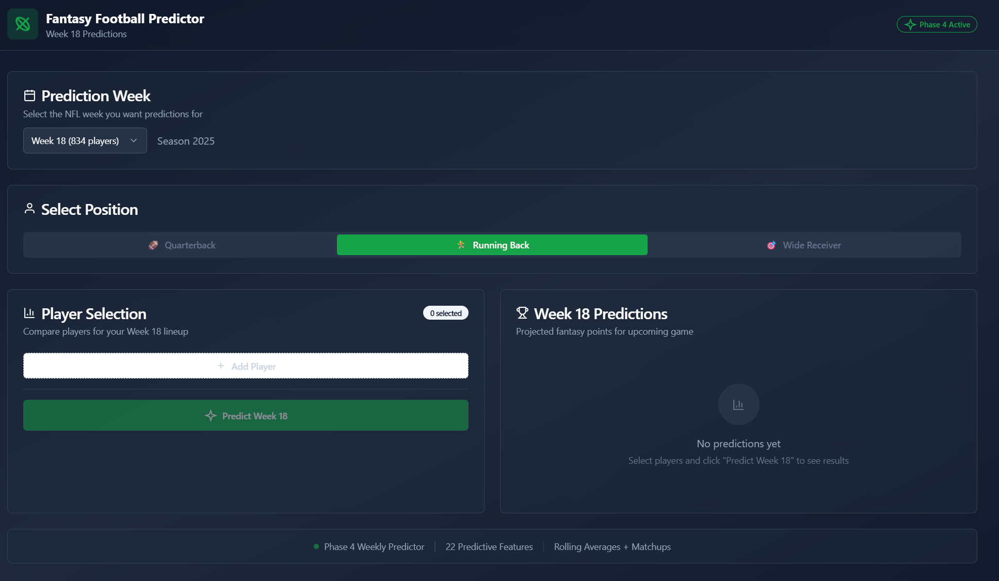
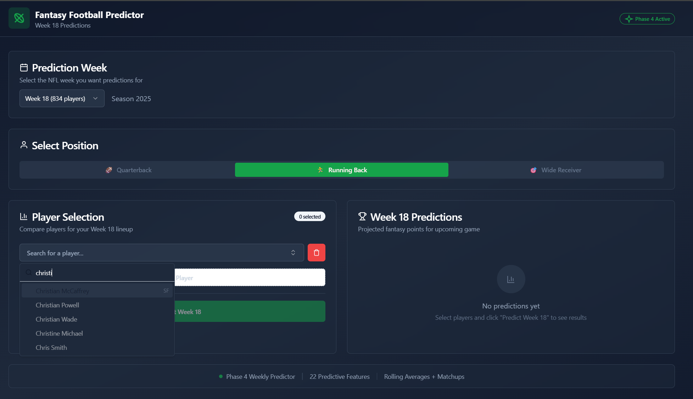
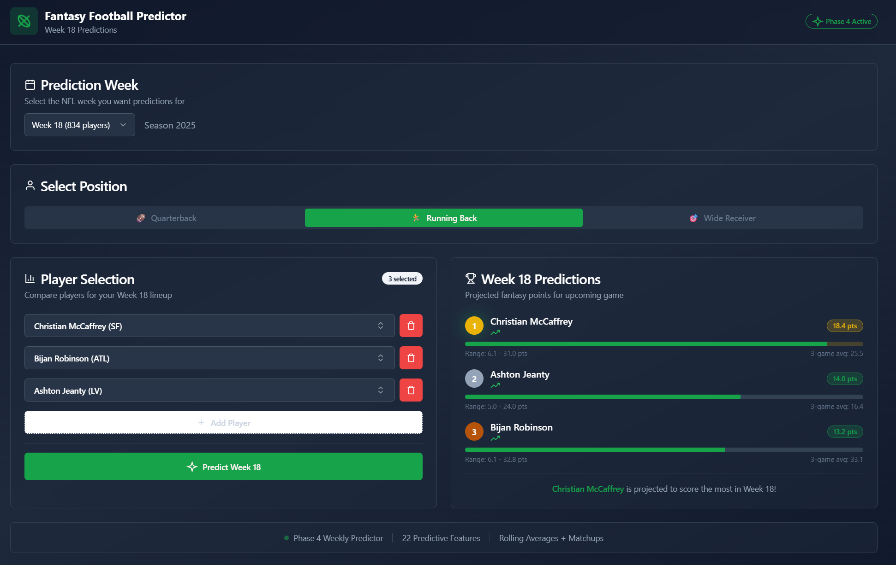

# Fantasy Football Predictor

A machine learning-powered fantasy football prediction application that helps you make start/sit decisions for your weekly lineup. The app uses XGBoost models trained on historical NFL data to predict player fantasy points with confidence intervals.

## Features

- **Position-based predictions** for Quarterbacks, Running Backs, and Wide Receivers
- **Searchable player dropdown** with type-to-filter functionality
- **Confidence intervals** showing prediction range (low-high)
- **3-game averages** for historical context
- **Ranked predictions** with medal-style display (gold, silver, bronze)
- **Real-time data** from Sleeper Fantasy API
- **Dark theme** with modern glassmorphism design

## Screenshots

### Homepage

Select your prediction week and position to get started.



### Player Search

Search through 800+ players with instant filtering.



### Prediction Results

Compare players with predicted points, confidence ranges, and 3-game averages.



## Architecture

```
┌─────────────────┐     ┌──────────────────┐     ┌─────────────────┐
│   React App     │────▶  Flask API        ────▶  PostgreSQL      │
│   (Port 3000)   │     │  (Port 5001)     │     │  (TimescaleDB)  │
└─────────────────┘     └──────────────────┘     └─────────────────┘
                               │
                               ▼
                        ┌──────────────────┐
                        │  XGBoost Model   │
                        │  (22 Features)   │
                        └──────────────────┘
```

**Backend (Python/Flask)** - `backend/`

- Flask REST API with CORS
- XGBoost weekly predictor model
- PostgreSQL + TimescaleDB for player data
- 22 predictive features (rolling averages, efficiency, matchups)

**Frontend (React + shadcn/ui)** - `frontend/fantasy-football/`

- Create React App with Tailwind CSS
- shadcn/ui component library
- Searchable combobox for player selection
- Responsive two-column layout

**Data Pipeline** - `backend/data_pipeline/`

- Sleeper API client for NFL player data
- Feature engineering (rolling averages, efficiency metrics)
- Automated weekly data sync

## Quick Start

### Prerequisites

- Python 3.8+
- Node.js 16+
- Docker (for PostgreSQL)

### 1. Start Database

```bash
cd backend
docker-compose up -d
```

### 2. Setup Backend

```bash
cd backend

# Create virtual environment
python -m venv venv

# Activate (Windows)
venv\Scripts\activate

# Activate (Mac/Linux)
source venv/bin/activate

# Install dependencies
pip install -r requirements.txt
pip install -r requirements_data_pipeline.txt

# Run automated setup (syncs data + trains model)
python setup_2025_season.py

# Start server
python app.py
```

### 3. Setup Frontend

```bash
cd frontend/fantasy-football
npm install
npm start
```

### 4. Open App

Navigate to <http://localhost:3000>

## API Endpoints

| Endpoint | Method | Description |
|----------|--------|-------------|
| `/players` | GET | Get players by position |
| `/predict_week` | POST | Get weekly predictions with confidence intervals |
| `/available_weeks` | GET | Get weeks with computed features |
| `/model_status` | GET | Check model availability |

### Example: Get Predictions

```bash
curl -X POST http://localhost:5001/predict_week \
  -H "Content-Type: application/json" \
  -d '{
    "position": "rb",
    "player_ids": ["4034", "6794"],
    "week": 18,
    "season": 2025
  }'
```

## Model Performance

| Position | MAE | R² | Top Features |
|----------|-----|-----|--------------|
| QB | 3.20 | 0.63 | passing_yds_avg_3, fantasy_pts_avg_3 |
| RB | 2.99 | 0.53 | touches_avg_3, fantasy_pts_avg_3 |
| WR | 2.72 | 0.48 | targets_avg_3, receptions_avg_3 |

## Predictive Features (22 total)

- **Rolling Averages**: Fantasy points, rushing/receiving/passing yards (3, 5, 10 games)
- **Efficiency**: Yards per carry, catch rate, TD per touch
- **Consistency**: Standard deviation, boom/bust rates, floor score
- **Trends**: 3-game linear regression slopes
- **Matchup**: Opponent position rank, home/away

## Project Structure

```
football/
├── backend/
│   ├── app.py                 # Flask API server
│   ├── weekly_predictor.py    # XGBoost prediction model
│   ├── setup_2025_season.py   # Automated setup script
│   ├── data_pipeline/         # Data sync and features
│   │   ├── sleeper_client.py  # Sleeper API client
│   │   └── features/          # Feature engineering
│   ├── models/                # Trained model files
│   └── docker-compose.yml     # PostgreSQL database
│
├── frontend/fantasy-football/
│   ├── src/
│   │   ├── App.js             # Main React component
│   │   └── components/ui/     # shadcn/ui components
│   ├── tailwind.config.js     # Tailwind configuration
│   └── package.json
│
└── docs/images/               # Screenshots
```

## Development

### Run Tests

```bash
cd backend
python run_tests.py all
```

### Retrain Model

```bash
cd backend
python weekly_predictor.py train
```

### Sync Latest Data

```bash
cd backend
python run_pipeline.py sync-players
python run_pipeline.py sync-stats 2025 18
python run_pipeline.py compute-features 2025 18
```

## Tech Stack

**Backend**

- Python 3.8+
- Flask + Flask-CORS
- XGBoost, scikit-learn
- PostgreSQL + TimescaleDB
- pandas, numpy

**Frontend**

- React 18
- Tailwind CSS
- shadcn/ui (Radix UI primitives)
- cmdk (searchable command menu)
- Axios

## License

MIT
