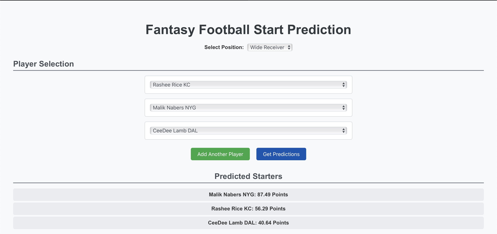

# Fantasy Football Start Prediction App

This is a fantasy football prediction app that helps you decide which players to start in your fantasy football league. The app uses data from the past 10 years to predict the best players to start, focusing on wide receivers, running backs, and quarterbacks.

## **Installation**

To set up the app, you need to install and configure both the backend (Flask) and the frontend (React).

### **Backend Setup**

1. **Navigate to the `backend` folder**:
   ```bash
   cd backend
    ```
2. **Create and activate a virtual environment (On Mac or Linux)**:
    ```bash
    python3 -m venv venv
    source venv/bin/activate
    ```
2. **Create and activate a virtual environment (On Windows)**:
    ```bash
    python3 -m venv venv
    venv\Scripts\activate
    ```
3. **Install the required Python packages**:
    ```bash
    pip install -r requirements.txt
    ```
4. **You may need to install tesseract-ocr on your machine**. You can download it from the following link: https://github.com/UB-Mannheim/tesseract/wiki. Or you can install it using homebrew
    ```bash
    brew install tesseract
    ```
    Or you can install it using apt-get
    ```bash
    sudo apt-get install tesseract-ocr
    ```
## Frontend
1. **Navigate to the `frontend` folder**:
   ```bash
   cd frontend
    ```
2. **Install the required npm packages**:
    ```bash
    npm install
    npm install axios
    ```


## Usage
To start the backend, cd into the backend folder and run the following command:
```bash:
python app.py
```
To start the frontend, cd into the frontend folder and run the following command:
```bash:
npm start
```
The frontend will start on http://localhost:3000 by default.
Now you can start using the app to predict the best players to start in your fantasy football league.

## Prediction Interface

Below is a screenshot of the prediction interface where users can select players and get predictions:


And here is a screenshot of the prediction results:
